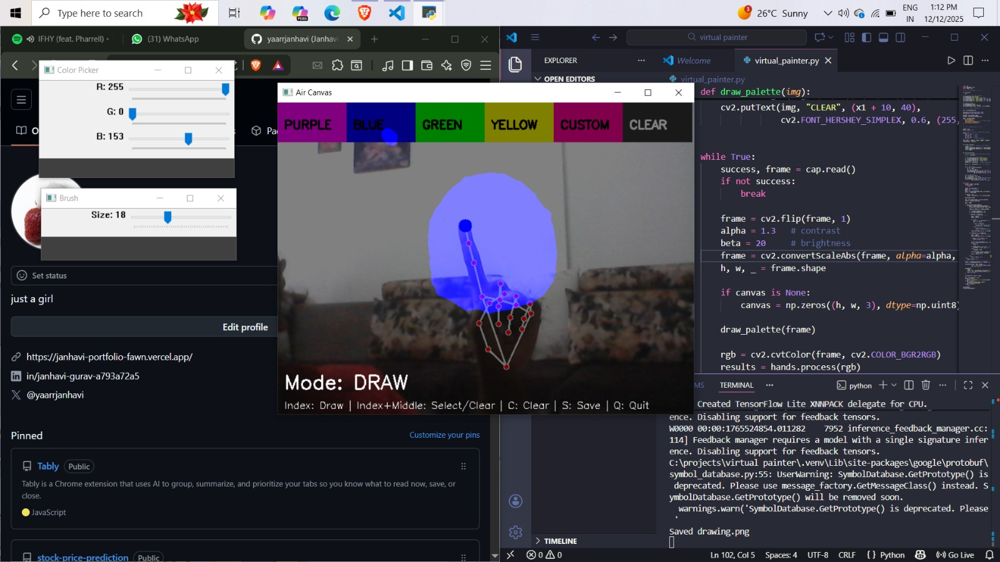
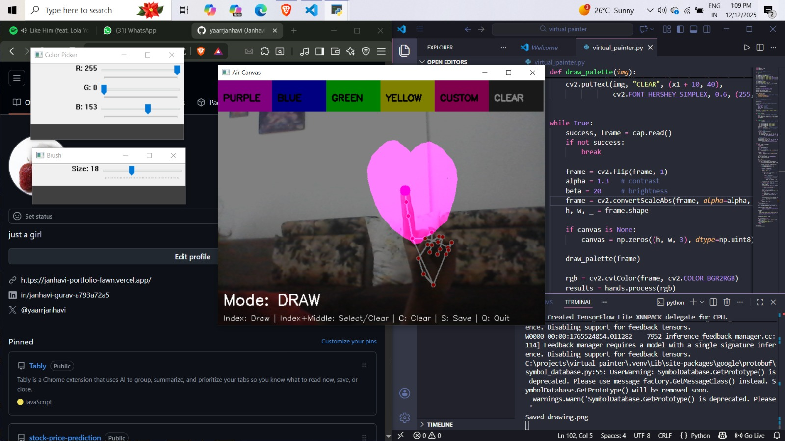
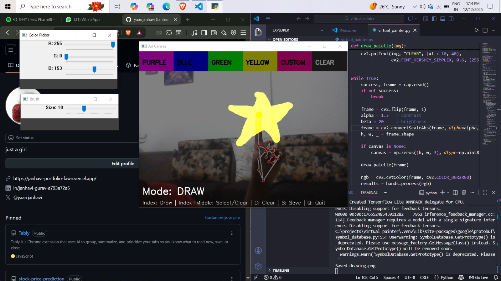

# Air Canvas Virtual Painter

Draw in the air using your index finger and see it appear on screen in real time. This project uses OpenCV and MediaPipe to track your hand, lets you choose any color with trackbars, change brush size, clear the canvas, and save your drawing.

## Features

- Real‑time hand tracking with MediaPipe.
- Draw mode (index finger up) and select/clear mode (index + middle up).
- Color palette with a custom color controlled by RGB trackbars.
- Brush size control with a trackbar.
- On‑screen **CLEAR** button and keyboard shortcuts:
  - `C` – clear canvas
  - `S` – save current drawing as `drawing.png`
  - `Q` – quit

## Screenshots

| Drawing view 1 | Drawing view 2 | Drawing view 3 |
| -------------- | -------------- | -------------- |
|  |  |  |

> Place your three images in an `assets/` folder and rename them to `screenshot1.png`, `screenshot2.png`, `screenshot3.png`, or update the paths above.

## Installation

1. Clone the repository:
```
git clone https://github.com/yaarrjanhavi/virtual-painter.git
cd air-canvas-virtual-painter
```

2. (Recommended) Create and activate a virtual environment:
```
python -m venv .venv
```
Windows:
```
..venv\Scripts\activate
```
MacOS/Linux:
```
source .venv/bin/activate
```

3. Install dependencies:
```
pip install -r requirements.txt
```

## Usage
Run the main script:
```
python virtual_painter.py
```

- Point your index finger towards the camera to draw.
- Raise index + middle fingers and tap on a color box (or **CLEAR**) at the top to change color or clear.
- Adjust RGB sliders in the **Color Picker** window for a custom color.
- Use the **Brush** window slider to change brush size.
- Press `S` to save your drawing, `C` to clear, and `Q` to quit.

## Screenshots

| Circle drawing | Heart drawing | Star drawing |
| -------------- | ------------- | ------------ |
|  |  |  |


## Acknowledgements

- Built with [OpenCV](https://opencv.org/) and [MediaPipe](https://developers.google.com/mediapipe/).

